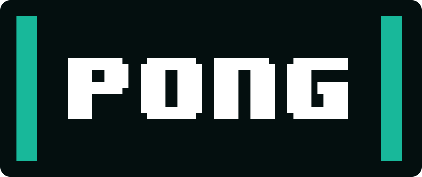
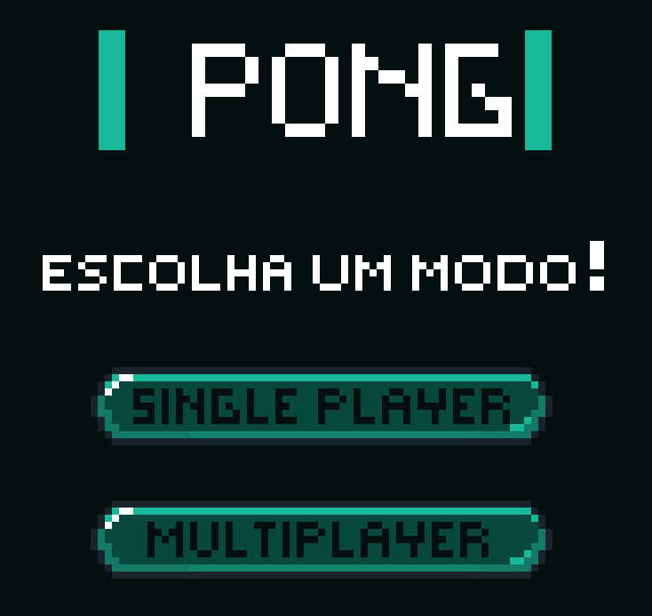
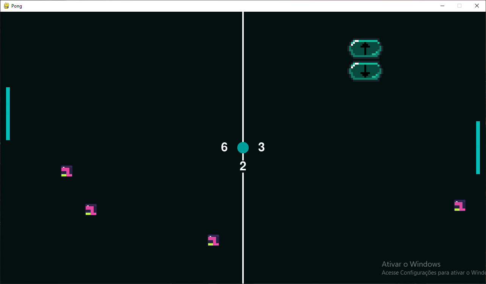
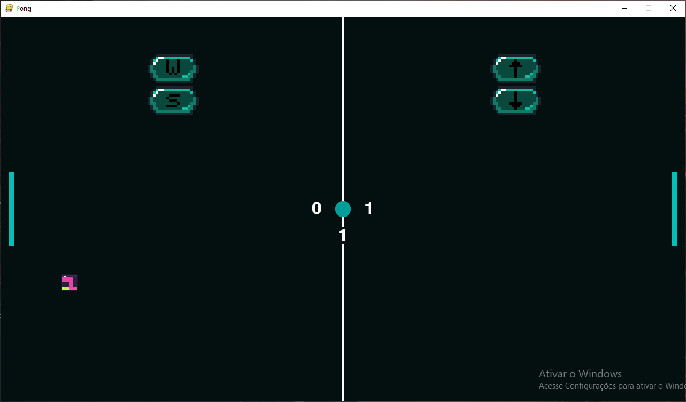

<p align="center">
  

  
  
  <a href="https://github.com/grochavieira/py-pong/commits/master">
    
  </a>
    
   

  <a href="https://github.com/grochavieira">
    
  </a>
  
 
</p>
<h1 align="center">
    
</h1>

<h4 align="center"> 
	🚧  Aplicação finalizada! 🚧
</h4>

## 🏁 Tópicos

<p>
 👉<a href="#-sobre-o-projeto" style="text-decoration: none; "> Sobre</a> <br/>
👉<a href="#-funcionalidades" style="text-decoration: none; "> Funcionalidades</a> <br/>
👉<a href="#-layout" style="text-decoration: none"> Layout</a> <br/>
👉<a href="#-como-executar-o-projeto" style="text-decoration: none"> Como executar</a> <br/>
👉<a href="#-tecnologias" style="text-decoration: none"> Tecnologias</a> <br/>
👉<a href="#-autor" style="text-decoration: none"> Autor</a> <br/>
👉<a href="#user-content--licença" style="text-decoration: none"> Licença</a>

</p>

## 💻 Sobre o projeto

Um jogo de pong feito em python para a matéria de Desenvolvimento de Jogos do 7° Semestre do curso de Ciência da Computação.

---

<a name="-funcionalidades"></a>

## ⚙️ Funcionalidades

- [x] Menu para escolher modo de jogo;
- [x] Animação com sprites;
- [x] Modo Single Player;
  - [x] Um oponente com uma "inteligência" básica;
  - [x] Indicação do botão para movimentar o jogador;
  - [x] A velocidade do oponente aumenta conforma o jogador faz pontos;
  - [x] Blocos irão aparecer a cada 5 segundos, e aumentam a velocidade da bola quando ela destroi eles.
- [x] Modo Multiplayer;
  - [x] 2 jogadores;
  - [x] Indicação dos botões utilizados para cada jogador;
  - [x] Blocos irão aparecer a cada 5 segundos, e aumentam a velocidade da bola quando ela destroi eles.

---

## 🎨 Layout

### Menu

<div align="center">
    
</div>

### Jogo Single Player

<div align="center">
    
</div>

### Jogo Multiplayer

<div align="center">
    
</div>

---

## 🚀 Como executar o projeto

### Pré-requisitos

Antes de começar, você vai precisar ter instalado em sua máquina a última versão do python e também
é necessário instalar o pygame.
Além disto é bom ter um editor para trabalhar com o código como [VSCode](https://code.visualstudio.com/)

#### 🧭 Rodando o jogo

```bash

# Clone este repositório
$ git clone https://github.com/grochavieira/py-pong.git

# Acesse a pasta do projeto no seu terminal/cmd
$ cd py-pong

# Acesse a pasta game
$ cd game

# Execute a aplicação
$ python main.py


```

---

## 🛠 Tecnologias

As seguintes ferramentas foram usadas na construção do projeto:

**Jogo** ([Python](https://www.python.org/) + [PyGame](https://www.pygame.org/news))

#### **Utilitários**

- Editor: **[Visual Studio Code](https://code.visualstudio.com/)**
- Fontes: **[Rajdhani](https://fonts.google.com/specimen/Rajdhani)**, **[Inter](https://fonts.google.com/specimen/Inter)**
- Criação dos Sprites: **[Piskel](https://www.piskelapp.com/)**

---

<a name="-autor"></a>

## 🦸‍♂️ **Autor**

<p>
<kbd>
 
 </kbd>
 <br />
 <sub><strong>🌟 Guilherme Rocha Vieira 🌟</strong></sub>
</p>

[](https://www.linkedin.com/in/grochavieira/)
[](mailto:guirocha.hopeisaba@gmail.com)

---

## 📝 Licença

Este projeto esta sobe a licença [MIT](./LICENSE).

Feito com :satisfied: por Guilherme Rocha Vieira 👋🏽 [Entre em contato!](https://www.linkedin.com/in/grochavieira/)

---
